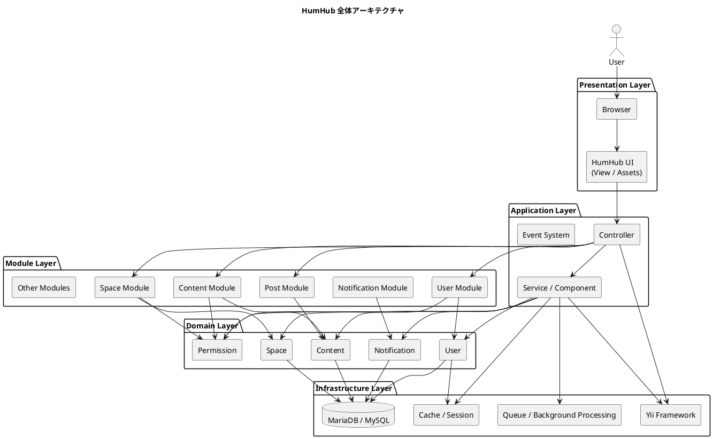
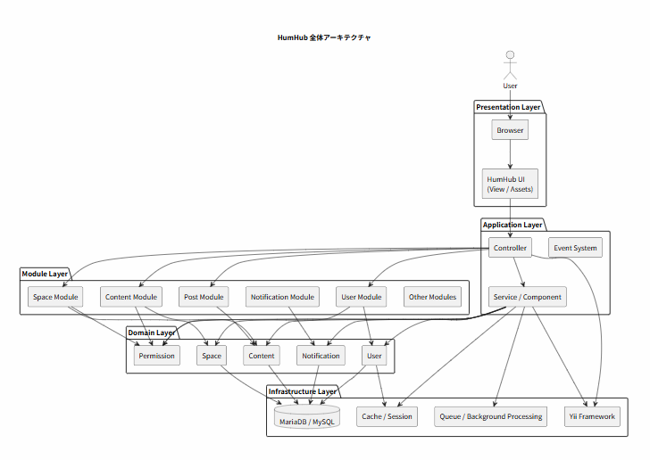
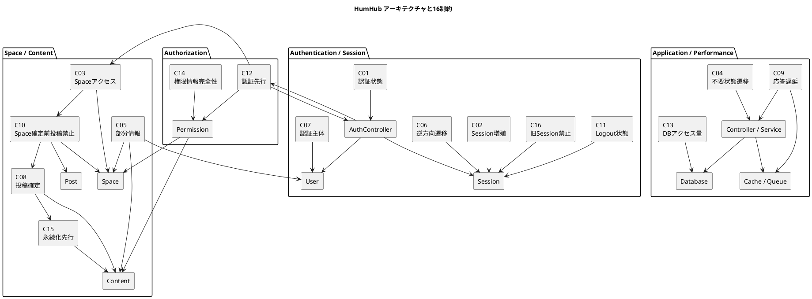
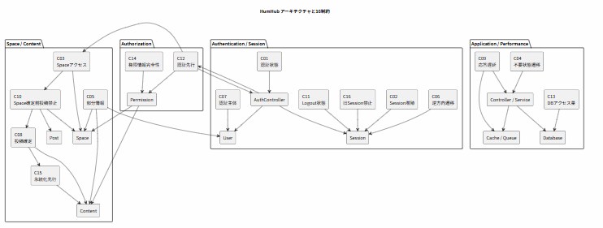
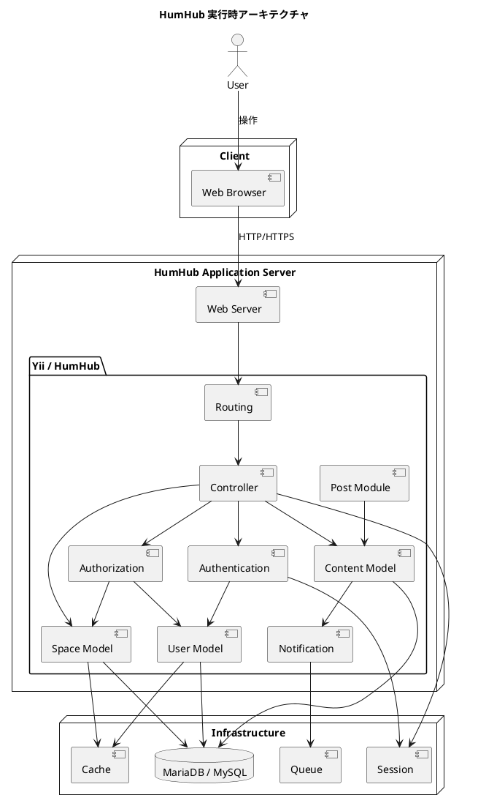

# text
・ビジネス系システム開発では、開発プロセスの開発工程（要求分析→分析→アーキテクチャ設計→詳細設計→実装→テスト）に沿って、モデルベースで開発を行うことが大切です。 

・要求分析では、ユーザ視点でユースケースモデルを作成することで、システムで実現すべき目的を明確にします。 

・分析では、開発者の視点でシステムを整理します。システムの静的な構造をクラス図を使って、動的な振る舞いをコミュニケーション図を使って整理します。 

・アーキテクチャ設計では、システム全体の設計方針を検討することで、機能要求、非機能要求を実現する仕組みを具体的に考えます。 

・詳細設計では、設計方針に従って個別の実現方法を計画し、分析モデルを設計モデルへと変換します。
# propose 既存のオープンソースから始める場合
１　オープンソースのアーキテクチャ、目的、目標がわかる図を３つ以上作成する

２　ソースコードから生成可能な状態遷移、シーケンス、タイミングを作成する

３　図とHAZOPの１１のGuideWordに基づいて分析する

４　ソースコードから１６種類の仕様書を作成する　ー＞細部の一部を理解する

５　アーキテクチャの図を３つ以上作成する。ー＞細部を理解してから全体の理解を図る。

# Q1 ここまでの作業をもとに、アーキテクチャのわかる図を３つ作成してください
a1 by chatgpt
はい。ここまでの **「HumHub → UML 3図 → HAZOP 11 Guide Words → 16制約 → 16仕様書」** を踏まえると、アーキテクチャを理解するためには、次の3枚が特に有効です。

1. **全体アーキテクチャ図**：HumHubを構成する層・主要コンポーネント
2. **制約・依存関係アーキテクチャ図**：C01～C16がどこに関係するか
3. **実行アーキテクチャ図**：Browser → Controller → Model → DB等の実行経路

---

# 1. HumHub全体アーキテクチャ

まず「HumHubは何からできているか」を俯瞰する図です。




### この図で重要なのは

HumHubを単純に

```text
PHP + MySQL
```

と考えないことです。

むしろ、

```text
UI
 ↓
Controller
 ↓
Service / Component
 ↓
Domain
 ↓
Module
 ↓
Infrastructure
```

という**複数の責務の層**として見るほうが、ソースコードを読むときに理解しやすくなります。

---

# 2. 16制約とアーキテクチャの関係

次は今回のHAZOP分析をアーキテクチャに重ねます。






これは今回の作業の中では、かなり重要な図です。

16制約を単なる一覧ではなく、

```text
認証
 ↓
認可
 ↓
Space
 ↓
Content
 ↓
永続化
```

という**アーキテクチャ上の依存関係**として見ることができます。

---

# 3. 実行時アーキテクチャ

最後は、実際に利用者が操作したとき、システム内部で何が起こるかです。



---

# 3枚を並べると

今回の分析では、この3枚を**ズームレベルの違うアーキテクチャ図**として扱うと分かりやすいです。

```text
                 ┌─────────────────────┐
                 │ ① 全体アーキテクチャ │
                 │                     │
                 │ UI                  │
                 │ Application        │
                 │ Domain             │
                 │ Module             │
                 │ Infrastructure      │
                 └─────────┬───────────┘
                           │
                           ▼
                 ┌─────────────────────┐
                 │ ② 制約アーキテクチャ │
                 │                     │
                 │ C01 ～ C16         │
                 │                     │
                 │ Auth               │
                 │ Permission         │
                 │ Space              │
                 │ Content            │
                 └─────────┬───────────┘
                           │
                           ▼
                 ┌─────────────────────┐
                 │ ③ 実行アーキテクチャ │
                 │                     │
                 │ Browser            │
                 │ Controller         │
                 │ Model              │
                 │ DB                 │
                 │ Session            │
                 └─────────────────────┘
```

そして、今回の分析を一枚の流れにすると、

```text
利用者の問題
     ↓
  HAZOP
11 Guide Words
     ↓
16 Constraints
     ↓
16 Specifications
     ↓
Architecture
     ↓
Source Code
     ↓
UML
```

となります。

**この構造はかなり良いです。**

特に次の段階では、今回の3枚をさらに一歩進めて、**「HumHubの実ソースコードのパッケージ／クラスをPlantUMLに落とし、C01～C16の制約を各クラス・メソッドにトレーサビリティリンクする」**と、HumHubのリバースエンジニアリング用の本格的なアーキテクチャモデルになります。

