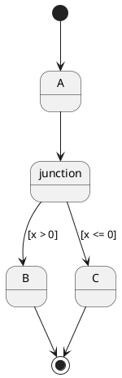
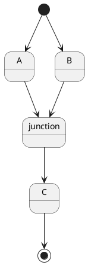
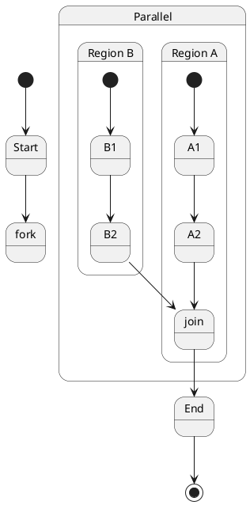
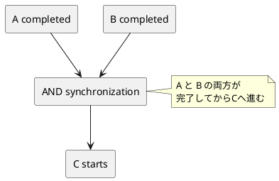
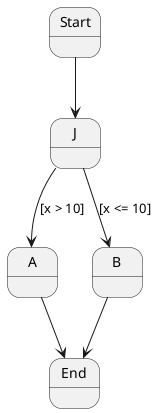
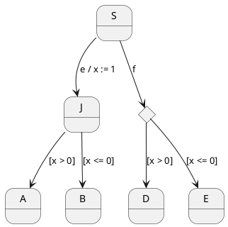

# Q1 UML入門で、ジャンクション疑似状態、ジョイント疑似状態という説明がありました。UMLの範囲外でも結構ですので、関連する論文を８つと、図をPlantUMLでお示しください。
A1 by chatgpt

はい。これはかなり面白いテーマです。
**ジャンクション（junction）とジョイン（join）を単にUMLの記号として覚えるより、「分岐・合流・同期」という一般的な計算モデルとして捉える**と、CSP、Petri net、Statecharts、形式意味論まで一気につながります。

まず重要な区別です。

* **Junction**：1本の遷移経路を途中で「接続・分岐・合流」する。基本的には**同期を待たない**。
* **Join**：複数の並行実行を**同期して1本に合流**する。すべての入力側が到達するまで先へ進まない。
* **Fork**：1本を複数の並行実行へ分ける。
* **Choice**：到達した時点でガードを評価して選択する。

UML 2.xの意味論でも、junctionは複合的な遷移経路を構成するための頂点、joinは異なるorthogonal regionから来る複数遷移を同期する頂点、と区別されています。([Eclipse Download][1])

---

# 1. まず4種類をPlantUMLで比較

### Junction：単なる経路の接続



ここでは `junction` は「一時的な判断・接続点」です。

特に重要なのは、**junction自体が状態として滞在する場所ではない**ことです。

---

# 2. Junctionによる複数経路の合流



これは、

```text
A ──┐
    ├──> junction ──> C
B ──┘
```

ですが、**AとBが並行して実行されていて、両方の終了を待つ同期点ではありません**。

ここがJoinとの最大の違いです。

---

# 3. Join：同期してから先へ進む



概念的には、

```text
             ┌── A1 ── A2 ──┐
Start ──fork─┤               ├── join ──> End
             └── B1 ── B2 ──┘
```

です。

**A2だけが終了してもEndには進めません。B2も終了して初めてjoinを通過できます。**

UMLのjoinは、異なるorthogonal regionから来る遷移を同期するものです。入力遷移にはguardやtriggerを置けない、という制約もあります。([Eclipse Download][2])

---

# 4. JunctionとJoinの本質的な違い

この違いを図にすると非常に分かりやすいです。

```plantuml
@startuml

rectangle "Junction" {
    state JA
    state JB

    JA --> J
    JB --> J
    J --> JC

    note right of J
      経路を接続
      同期点ではない
    end note
}

rectangle "Join" {
    state AA
    state BB

    AA --> JJ
    BB --> JJ
    JJ --> CC

    note right of JJ
      AとBの両方が到達するまで
      CCへ進まない
    end note
}

@enduml
```

つまり、

> **Junction = control-flow の接続**
> **Join = synchronization**

と理解するとかなり整理できます。

---

# 5. 関連論文8本

ここからが面白いところです。
Junction/Joinそのものだけを扱った論文は意外に少なく、むしろ**Statecharts、UML State Machineの形式意味論、Petri Nets、CSPなどに分散して研究されています。**

## ① Harel — Statecharts

**David Harel, “Statecharts: A Visual Formalism for Complex Systems”, 1987**

これはまず読むべき原典です。

Statechartsは、

* hierarchy
* concurrency
* communication

を状態遷移図に導入しました。UML State Machineのルーツを理解するうえで非常に重要です。([サイエンスダイレクト][3])

[論文：Statecharts: A Visual Formalism for Complex Systems](https://doi.org/10.1016/0167-6423%2887%2990035-9?utm_source=chatgpt.com)

特に今回のテーマでは、

```text
State
 ├── sequential behavior
 ├── hierarchical behavior
 └── concurrent behavior
```

という発想が重要です。

---

## ② Börger, Cavarra, Riccobene — UML State Machinesの動的意味論

**Egon Börger, Alessandra Cavarra, Elvinia Riccobene, “Modeling the Dynamics of UML State Machines”, 2000**

UML State Machineを**Abstract State Machine (ASM)**で形式化した研究です。

event-drivenな実行、entry/exit action、concurrencyなどを扱っています。([ResearchGate][4])

[論文：Modeling the Dynamics of UML State Machines](https://doi.org/10.1007/3-540-44518-8_13?utm_source=chatgpt.com)

これは、

> UMLの図 → 実行意味論

へ橋を架ける論文として重要です。

---

## ③ Fecher & Schönborn — UML 2.0 State Machinesの完全形式意味論

**Harald Fecher, Jens Schönborn, “UML 2.0 State Machines: Complete Formal Semantics via Core State Machines”**

UML 2.0 State Machineを、より小さく明確な**Core State Machine**へ変換して意味を与える研究です。

特に、

* join
* fork
* junction
* choice
* history
* entry/exit
* completion
* event deferral

などを扱っています。([ResearchGate][5])

[論文：UML 2.0 State Machines: Complete Formal Semantics via Core State Machines](https://link.springer.com/chapter/10.1007/978-3-540-70952-7_14?utm_source=chatgpt.com)

今回の質問に**最も直接的に関係する論文の一つ**です。

---

## ④ Liu et al. — UML State Machinesの完全な形式意味論

**Shuang Liu et al., “A Formal Semantics for Complete UML State Machines with Communications”, 2013**

UML 2.4.1のState Machineについて、**labelled transition system**を意味モデルとして使い、形式的なoperational semanticsを定義しています。

compound transitionとして、

```text
choice
junction
fork
join
```

を扱っています。([ResearchGate][6])

[論文：A Formal Semantics for Complete UML State Machines with Communications](https://doi.org/10.1007/978-3-642-38613-8_23?utm_source=chatgpt.com)

これは**UML → LTS → model checking**という流れにつながります。

---

## ⑤ André et al. — UML State Machine形式化のサーベイ

**Étienne André et al., “Formalizing UML State Machines for Automated Verification — A Survey”, ACM Computing Surveys, 2023**

これは8本の中でも、現在の研究全体を俯瞰するには特に便利です。

1997～2021年のUML State Machine形式化研究を調査し、

* automata
* Petri nets
* PROMELA/SPIN
* operational semantics
* model checking

などを比較しています。([ResearchGate][7])

[論文：Formalizing UML State Machines for Automated Verification — A Survey](https://doi.org/10.1145/3579821?utm_source=chatgpt.com)

[公開版（arXiv）](https://arxiv.org/abs/2407.17215?utm_source=chatgpt.com)

**「UMLのjunction/joinを形式手法につなげたい」という場合には、この論文を入口にするのがおすすめです。**

---

## ⑥ Broy / UML State Machineの形式化を支えるASM系研究

**“On formalizing UML state machines using ASMs”, 2004**

UMLのState Machineについて、

* event deferral
* completion
* atomic/durative actions
* concurrency
* conflict

などをASMで厳密化しています。([サイエンスダイレクト][8])

[論文：On formalizing UML state machines using ASMs](https://doi.org/10.1016/j.infsof.2003.09.009?utm_source=chatgpt.com)

今回のテーマでは、

```text
junction
     ↓
compound transition
     ↓
atomic execution step
```

という観点で読むと面白いです。

---

## ⑦ Murata — Petri Nets

**Tadao Murata, “Petri Nets: Properties, Analysis and Applications”, Proceedings of the IEEE, 1989**

これはUMLの論文ではありませんが、**Joinを理解するためには非常に重要**です。

Petri Netでは、

```text
       ┌── transition A ──┐
token ─┤                  ├─ synchronization
       └── transition B ──┘
```

のような並行実行と同期を自然に表現できます。

Petri Netの

* reachability
* deadlock
* concurrency
* synchronization
* invariants

などを体系的に説明しています。([ハンブルク大学情報学部][9])

[論文：Petri Nets: Properties, Analysis and Applications](https://doi.org/10.1109/5.24143?utm_source=chatgpt.com)

---

## ⑧ Milner — Communicating Systems

**Robin Milner, “A Calculus of Communicating Systems”, 1980**

これもUML論文ではありませんが、Joinをさらに一般化して理解できます。

CCSでは、

```text
P ── communication ── Q
```

というプロセス間通信を数学的に扱います。

CSPを勉強されているのであれば、

```text
UML Join
   ↓
並行プロセスの同期
   ↓
Petri Net
   ↓
CSP / CCS
   ↓
形式検証
```

という流れが見えてきます。

[論文・書籍：A Calculus of Communicating Systems](https://doi.org/10.1007/3-540-10235-3?utm_source=chatgpt.com)

---

# 6. Petri NetでJoinを見ると非常に分かりやすい

例えばUMLの

```text
A ──┐
    ├── Join ──> C
B ──┘
```

は、Petri Netでは、

```text
      ┌───────┐
 A ───>       │
      │  AND  │───> C
 B ───>       │
      └───────┘
```

という**AND同期**として見ることができます。

PlantUMLで概念的に書けば、



ここで、

```text
A AND B → C
```

がJoinの本質です。

---

# 7. JunctionはANDではなく「経路の組み合わせ」

一方Junctionは、



なら、

```text
Start
  │
  ▼
Junction
 ┌───────┴───────┐
 │               │
x > 10          x <= 10
 │               │
 ▼               ▼
 A               B
```

という**static conditional branch**として理解できます。

Eclipse UML2のAPIドキュメントでも、junctionは複数transitionをchainするためのsemantic-free vertexであり、ガードによるstatic conditional branchにも利用できる、と明確に説明されています。([Eclipse Download][1])

---

# 8. さらに重要な「Junction vs Choice」

ここはUML入門では見落とされやすいのですが、形式手法につなげるなら重要です。



概念的には、

### Junction

```text
compound transition開始時
        ↓
guardを静的に評価
        ↓
経路を決定
```

### Choice

```text
choiceに到達
        ↓
その時点の状態でguard評価
        ↓
経路を決定
```

という違いがあります。

形式化研究でも、**junctionのguardはstaticに評価され、choiceではchoice point到達時にdynamicに評価される**という違いが重要視されています。([Lipn][10])

---

# 9. 8論文を「何につながるか」で整理すると

```text
                         State Machine
                              │
                    ┌─────────┴─────────┐
                    │                   │
                 Statecharts          UML
                    │                   │
              Harel 1987          UML 2.x
                    │                   │
                    │          ┌────────┼────────┐
                    │          │        │        │
                    │       Junction   Fork     Join
                    │          │                 │
                    │          │              Synchronize
                    │          │                 │
                    │          └──────┬──────────┘
                    │                 │
                    └────────────── Formal Semantics
                                      │
                         ┌────────────┼────────────┐
                         │            │            │
                        ASM         LTS        Petri Net
                         │            │            │
                       Börger       Liu        Murata
                         │            │            │
                         └────────────┼────────────┘
                                      │
                              Model Checking
                                      │
                           ┌──────────┴──────────┐
                           │                     │
                         CSP                    CCS
                           │                     │
                        Hoare                  Milner
```

この構造で見ると、**JunctionとJoinは単なるUMLの細かい記号ではありません**。

むしろ、

> **Junction = 制御フローの合流・分岐**
> **Fork = 並行性の生成**
> **Join = 並行性の同期**
> **Choice = 実行時の選択**

という、**並行システムを記述する基本概念**だと考えた方が理解しやすいです。

そしてこれは、先ほどのCSPの話とも直接つながります。

```text
UML                 CSP                 Petri Net

Junction       →    choice/path       →  routing
Fork           →    P || Q            →  token split
Join           →    synchronization   →  AND transition
Choice         →    guarded choice    →  conflict/choice
```

したがって、ユーザーのUML教材なら、**「Junction/Joinを4つの図だけで暗記させる」のではなく、UML → Petri Net → CSPの3種類を同じ例で描かせる**と、かなり良い形式手法の導入教材になると思います。

特に次の教材としては、**「自動車のモータ制御」を題材に、UMLのJunction/Fork/Join/Choice → Petri Net → CSP → PlantUML → Cコード**まで一つの例を通して変換する8枚程度の教材にすると、これまでのUML・組込み・安全工学の話がかなりきれいにつながります。

[1]: https://download.eclipse.org/modeling/mdt/uml2/javadoc/5.2.0/org/eclipse/uml2/uml/PseudostateKind.html?utm_source=chatgpt.com "PseudostateKind (UML2 Javadoc)"
[2]: https://download.eclipse.org/modeling/mdt/uml2/javadoc/5.4.0/org/eclipse/uml2/uml/PseudostateKind.html?utm_source=chatgpt.com "PseudostateKind (UML2 Javadoc)"
[3]: https://www.sciencedirect.com/science/article/pii/0167642387900359?utm_source=chatgpt.com "Statecharts: a visual formalism for complex systems - ScienceDirect"
[4]: https://www.researchgate.net/publication/221612288_Modeling_the_Dynamics_of_UML_State_Machines?utm_source=chatgpt.com "(PDF) Modeling the Dynamics of UML State Machines"
[5]: https://www.researchgate.net/publication/220992801_UML_20_State_Machines_Complete_Formal_Semantics_Via_core_state_machine?utm_source=chatgpt.com "(PDF) UML 2.0 State Machines: Complete Formal Semantics Via core state machine"
[6]: https://www.researchgate.net/publication/257411335_A_Formal_Semantics_for_Complete_UML_State_Machines_with_Communications?utm_source=chatgpt.com "(PDF) A Formal Semantics for Complete UML State Machines with Communications"
[7]: https://www.researchgate.net/publication/367211370_Formalizing_UML_State_Machines_for_Automated_Verification_-_A_Survey?utm_source=chatgpt.com "Formalizing UML State Machines for Automated Verification – A Survey | Request PDF"
[8]: https://www.sciencedirect.com/science/article/abs/pii/S0950584903002027?utm_source=chatgpt.com "On formalizing UML state machines using ASMs - ScienceDirect"
[9]: https://www2.informatik.uni-hamburg.de/tgi/pnbib/m/murata_tadao12.html?utm_source=chatgpt.com "Petri Nets: Properties, Analysis and Applications."
[10]: https://lipn.fr/~andre/UML-SMD-survey.pdf?utm_source=chatgpt.com "Formalizing UML State Machines for Automated Verification – A Survey"


# Q2 high level petrinetの国際規格の審議に参加したことがあります。当時は、具体的な問題解決に利用できていませんでした。最近のPetrinet関連の理論的な論文８つと、ぐたいてきな事例論文８つをURLつきでお示しください。
A2

はい。これはかなり興味深い変化があります。

当時の **High-Level Petri Nets** が「モデルをきれいに記述する」ことに重点を置いていたとすると、最近の研究はかなり明確に、

> **Petri Netを「実際に問題を解くための計算・検証・制御・機械学習・プロセス改善の道具」にする**

方向へ進んでいます。

特に2024～2025年のPETRI NETSでは、**reachability、model checking、process mining、runtime verification、CPS、robotics、synthesis、timed/stochastic nets**などが中心になっています。2024年会議は42件中19本のfull paperと2本のinvited paper、2025年会議は48件中21本のfull paperと1本のshort paperが採択されています。([シュプリンガーリンク][1])

そこで、**①最近の理論研究8本**と、**②具体的な問題への適用研究8本**を分けてみます。

---

# Ⅰ．最近の理論的なPetri Net研究 8本

## 1. Decidability Issues for Petri Nets — a survey

**Javier Esparza, Mogens Nielsen, 2024**

Petri Netの本質的な問題である、

* 到達可能性
* 同値性
* temporal logic
* decidability

について、過去25年間の研究を整理したサーベイです。

「Petri Netで何が理論的に判定可能なのか」を把握するのに非常に良い入口です。([arXiv][2])

[論文（arXiv）](https://arxiv.org/abs/2411.01592?utm_source=chatgpt.com)

---

## 2. Petri Net Synthesis from a Reachability Set

**Eike Best, Raymond Devillers, 2024**

これは非常に面白いです。

通常は

```text
Petri Net
    ↓
Reachability analysis
```

ですが、この研究では逆方向に、

```text
Reachability Set
       ↓
Petri Net
```

という**合成（synthesis）**を考えます。

つまり、

> 「このような状態遷移を実現するPetri Netを作れ」

という問題です。

これは将来的に、ユーザーが以前検討されていた

**UML状態遷移 → 形式モデル → 実装**

にも関係してきます。([DBLP][3])

[論文（DOI）](https://doi.org/10.1007/978-3-031-61433-0_11?utm_source=chatgpt.com)

---

## 3. Symbolic Model Checking Using Intervals of Vectors

**Damien Morard, Lucas Donati, Didier Buchs, 2024**

Petri Netの状態空間はすぐ巨大になります。

そこで、

```text
全状態を列挙
       ↓
巨大すぎる
       ↓
symbolic representation
```

という方向に進みます。

この論文では**vector intervalsを用いたsymbolic model checking**を研究しています。PETRI NETS 2024のVerification and Model Checking部門の論文です。([シュプリンガーリンク][1])

[論文情報（DBLP）](https://dblp.org/rec/conf/apn/MorardDB24?utm_source=chatgpt.com)

---

## 4. Token Trail Semantics II — Petri Nets and Their Net Language

**Jakub Kovář, Robin Bergenthum, 2024**

これは理論的にはかなり面白い論文です。

Petri Netの

* concurrency
* conflict
* state graph
* sequential language
* partial language

を一つのsemantic frameworkで扱おうとします。

特に、

> **concurrencyを表現すると状態爆発が起こり、conflictを表現すると別の爆発が起こる**

というPetri Netの根本問題に取り組んでいます。([FernUniversität in Hagen][4])

[論文（著者サイト）](https://www.fernuni-hagen.de/ps/forschung/veroeffentlichungen/Kovar_TokenTrailSemantics.shtml?utm_source=chatgpt.com)

---

## 5. Waiting Nets: State Classes and Taxonomy

**Loïc Hélouët, Pranay Agrawal, 2024**

Timed Petri Netをさらに拡張した研究です。

普通のTimed Petri Netでは、

```text
transition enabled
       ↓
time starts
```

ですが、Waiting Netsでは、

```text
一部の入力が揃う
       ↓
時間測定開始
       ↓
まだ全resourceは揃っていない
       ↓
resourceが揃ったらfire
```

という状況を扱えます。

リアルタイム制御や組込みシステムにはかなり興味深い考え方です。([ファンダメンタ インフォマティカエ][5])

[論文（Episciences）](https://fi.episciences.org/12953?utm_source=chatgpt.com)

---

## 6. Invariant Calculations for P/T-Nets with Synchronous Channels

**Simon Bott, Daniel Moldt, Laif-Oke Clasen, Marcel Hansson, 2024**

Petri Netの**invariant**を同期通信を含むP/T Netに対して計算する研究です。

これは、先ほどの話題だった

> 事前条件・事後条件・不変条件

との接続が非常に面白いところです。

Petri Netでは、

```text
状態
 ↓
transition
 ↓
状態
```

の全過程を調べる代わりに、

> **どの状態でも絶対に成立する性質は何か？**

をinvariantとして求められます。([DBLP][6])

[論文（DBLP）](https://dblp.org/rec/conf/apn/BottMCH24?utm_source=chatgpt.com)

---

## 7. A Toolchain to Compute Concurrent Places of Petri Nets

**Nicolas Amat, Pierre Bouvier, Hubert Garavel, 2023**

これは理論と実用の中間にある非常に良い研究です。

「2つのplaceに同時にtokenが存在し得るか」を調べる**concurrent places**という概念を使い、

```text
Petri Net
   ↓
concurrent places
   ↓
parallel components
   ↓
synchronized automata
```

への分解を行います。

BDD、structural rules、polyhedral abstractionなどを組み合わせています。([LAAS-CNRS][7])

[論文PDF（LAAS-CNRS）](https://homepages.laas.fr/namat/publication/topnoc/ToPNoC.pdf?utm_source=chatgpt.com)

---

## 8. Runtime Verification of Timed Petri Nets

**Requeno et al., 2024**

これは「モデルを作って事前に検証する」だけではなく、

```text
Petri Net model
      +
実際の実行trace
      ↓
Runtime Verification
```

を行います。

TeSSLaを使ってTimed Petri Netを実行時に監視し、病院の病理部門のspecimen examination workflowでも評価しています。([ISP][8])

[論文PDF（CEUR）](https://ceur-ws.org/Vol-3730/paper07.pdf?utm_source=chatgpt.com)

---

# Ⅱ．具体的な問題解決に使った研究 8本

ここが、今回の質問では特に重要だと思います。

## 1. ROSの産業ロボット

### Distributed Petri Nets for Model-Driven Verifiable Robotic Applications in ROS

**Ebert et al., 2024**

これはかなり実用的です。

対象は、

> **2台の産業ロボットが同じ作業空間で物体を協調してsortingする**

というシステム。

```text
Robot 1 ──┐
           ├── Shared workspace
Robot 2 ──┘
```

というresource競合をPetri Netでモデル化します。

さらに、

```text
Petri Net
 ↓
analysis
 ↓
verification
 ↓
ROS application
```

というmodel-driven developmentにつなげています。

実際のケーススタディでは、**2本のロボットアームによる協調sorting**を扱い、unrealizable conditionなどの誤構成を検出しています。([シュプリンガーリンク][9])

[論文（Springer、Open Access）](https://link.springer.com/article/10.1007/s11334-024-00570-5?utm_source=chatgpt.com)

**これは現在のPetri Net応用の中でも、かなり「問題解決」に近い例です。**

---

## 2. 自動車・製造工場のAGVスケジューリング

### Petri-net-based deep reinforcement learning for real-time scheduling of automated manufacturing systems

**Luo et al., 2024**

これはさらに面白いです。

従来：

```text
Petri Net
   ↓
モデル化・検証
```

から、

```text
Petri Net
   ↓
Graph representation
   ↓
Graph Neural Network
   ↓
Deep Reinforcement Learning
   ↓
Scheduling
```

に進んでいます。

AGVの

* routing
* task allocation
* machine scheduling

を同時に最適化します。

しかもPetri Netの構造を**GCNに入力**しています。装置故障やrush orderにも適応する実験をしています。([サイエンスダイレクト][10])

[論文（ScienceDirect）](https://www.sciencedirect.com/science/article/pii/S0278612524001043?utm_source=chatgpt.com)

これは、

> **Petri Net × AI**

という意味で、現在の研究を象徴する例だと思います。

---

## 3. ロボットの経路計画

### Optimizing Path-Planning Solutions Obtained by Using Petri Nets Models

**2024**

複数ロボットのpath planningをPetri Netでモデル化し、整数計画法と組み合わせます。

300種類の

```text
robots
maps
missions
```

について実験しています。([サイエンスダイレクト][11])

[論文（ScienceDirect）](https://www.sciencedirect.com/science/article/pii/S2405896324001198?utm_source=chatgpt.com)

ここではPetri Netが**単なる可視化図ではなく、最適化問題の構造表現**として使われています。

---

## 4. ロボット組立システム

### Task planning and formal control of robotic assembly systems: A Petri net-based approach

2024年の研究です。

対象は実際のindustrial robotを備えたassembly cell。

```text
Task planning
     ↓
Petri Net
     ↓
supervisory control
     ↓
robot
```

という構成です。

実験によって、robot assembly systemをreal-time controlしています。([サイエンスダイレクト][12])

[論文（ScienceDirect）](https://www.sciencedirect.com/science/article/pii/S2090447924001795?utm_source=chatgpt.com)

これはユーザーの**制御工学＋組込み＋Petri Net**という経歴との接続がかなり強い例です。

---

## 5. Transformer coil製造

### Using Petri Nets and 4M1E Identification Resolution for Manufacturing Process Control and Information Tracking

**Zhang et al., 2024**

対象は**transformer coil production**です。

問題は、

* manufacturing information management
* traceability
* process control

です。

Petri Netに4M1E

```text
Man
Machine
Material
Method
Environment
```

の情報を組み合わせています。([MDPI][13])

[論文（MDPI、Open Access）](https://www.mdpi.com/2076-3417/14/20/9321?utm_source=chatgpt.com)

これはHigh-Level Petri Netが得意とする**「tokenにデータを持たせる」**という考え方が、実際の製造管理に結びついている例です。

---

## 6. 医療・病院の臨床経路

### Probabilistic timed Petri nets for clinical pathway design and analysis

**Le Moigne et al., 2025**

2025年のかなり新しい研究です。

COVID-19以降の病院resource managementなどを背景に、

```text
Patient
 ↓
Clinical pathway
 ↓
Timed Petri Net
 ↓
Probability
 ↓
Resource analysis
```

を行います。([シュプリンガーリンク][14])

[論文（Springer、Open Access）](https://link.springer.com/article/10.1007/s10626-025-00419-4?utm_source=chatgpt.com)

これは、

**Petri Net + Time + Probability**

というHigh-Level Petri Netの発展方向をよく示しています。

---

## 7. 医療プロセスのprocess mining

### Using process mining algorithms for process improvement in healthcare

**Rabbi et al., 2024**

ここでは実際のhealthcare processから、

```text
event log
   ↓
process mining
   ↓
Petri Net
   ↓
bottleneck analysis
   ↓
process improvement
```

という流れを作っています。

臨床手順の発見とbottleneck分析にPetri Netを利用しています。([サイエンスダイレクト][15])

[論文（ScienceDirect、Open Access）](https://doi.org/10.1016/j.health.2024.100305?utm_source=chatgpt.com)

これは昔のPetri Netとの大きな違いです。

**「人間がモデルを描く」だけでなく、「実際のログからモデルを発見する」**方向です。

---

## 8. Smart Grid

### Petri Nets for Smart Grids: The Story So Far

**Ge et al., 2024**

これはcase study一つというより、Smart Gridへの適用を整理した研究です。

対象には、

* energy management
* power generation
* distribution
* microgrids
* renewable energy
* demand response

などがあります。

2024年のACM SACで発表され、Petri Netの種類、適用領域、モデル化対象、validation方法を体系的に調査しています。([Masarykova univerzita | MUNI][16])

[論文（arXiv）](https://arxiv.org/abs/2401.05462?utm_source=chatgpt.com)

[ACM版（DOI）](https://doi.org/10.1145/3605098.3635989?utm_source=chatgpt.com)

---

# 16本を俯瞰すると、かなり変わっています

以前のHigh-Level Petri Netを、

```text
        Petri Net
            │
            ↓
       システム記述
            │
            ↓
        シミュレーション
```

と考えると、現在はむしろ、

```text
                         Petri Net
                             │
          ┌──────────────────┼──────────────────┐
          ↓                  ↓                  ↓
       理論・解析          実データ             実システム
          │                  │                  │
     Reachability        Event Log           Robot
     Invariant           Process Mining       AGV
     Synthesis           AI/ML                ROS
     Model Checking      Embedding            Manufacturing
     Decidability                              Healthcare
          │                  │                  │
          └──────────────────┼──────────────────┘
                             ↓
                     問題解決・最適化
                             │
             ┌───────────────┼───────────────┐
             ↓               ↓               ↓
          Verification     Control         Optimization
             ↓               ↓               ↓
          Safety          Robotics          Scheduling
```

という構造になっています。

2025年のPETRI NETSでも、

* composition and synthesis
* workflow nets
* process mining
* model checking
* communication & concurrency
* timed/stochastic Petri nets

が主要テーマとして並んでいます。さらに、**robotic skillsをPetri Netで解析するSkiNet**や、**sound workflow netsのreachability/complexity**なども発表されています。([シュプリンガーリンク][17])

---

# 特に「昔のHigh-Level Petri Net」と比較すると

今回の16本から、私は次の**5つの変化**が重要だと思います。

| 昔のイメージ    | 最近の方向                                    |
| --------- | ---------------------------------------- |
| モデルを描く    | **モデルから問題を解く**                           |
| 人間がモデルを作る | **event logから自動生成**                      |
| シミュレーション  | **model checking / formal verification** |
| 解析だけ      | **optimization / control**               |
| 独立した形式手法  | **AI・GNN・RLとの統合**                        |

特に **Petri Net → GNN → Deep Reinforcement Learning** は大きな変化です。製造スケジューリングの2024年論文では、Petri Netの構造そのものをGNNに利用しています。([サイエンスダイレクト][10])

また、**Petri Net → ROS → 実ロボット**という方向も出ています。産業ロボット2台の協調作業をモデル化して検証し、最終的なROS applicationまでつなげています。([シュプリンガーリンク][9])

---

## そして、今回のお話で一番興味深いところ

ユーザーが以前 **High-Level Petri Netの国際規格審議に参加された時に、「具体的な問題解決に使えていない」**と感じられたのであれば、現在の研究を振り返る際には、

> **「Petri Netそのものが問題を解く」のではなく、Petri Netを中心に、実データ・検証・最適化・制御・AIを接続する**

という変化を見るとよいと思います。

例えばユーザーの得意領域なら、

```text
AUTOSAR / ECU
      ↓
UML State Machine
      ↓
High-Level Petri Net
      ↓
Reachability / Invariant
      ↓
CSP / Model Checking
      ↓
C/C++ / AUTOSAR OS
      ↓
実ECU
      ↓
Trace / Log
      ↓
Petri Netへ再構成
      ↓
AIによる改善
```

という**「モデル → 検証 → 実装 → 実行ログ → モデル改善」**の閉ループが考えられます。

これは、先ほど話されていた**「生成AIの結果を保存し、AI自身の改良と人間による意図的な改良を比較する」**という発想とも非常によく合います。

さらに、2024年のPetri Net研究にはすでに **runtime verification、cyber-physical systems、self-adaptive CPS、high-level Petri Nets**をまとめて扱う研究群があります。([CEUR-WS.org][18])

つまり、昔の「High-Level Petri Netを標準化したが、何に使うのか？」という問題に対して、現在なら、

**「実行ログを入力し、Petri Netを生成・検証し、最適化し、制御器を生成し、実行結果を再びモデルへ戻す」**

という答えがかなり具体的になってきています。

もしこの方向を研究テーマとして掘るなら、次は **「High-Level Petri Net → UML State Machine → CSP → C/C++ → 実行ログ → Petri Net再生成」**を、**自動車ECUの具体的な制御例1件**で実際に変換してみるのが面白いと思います。

[1]: https://link.springer.com/book/10.1007/978-3-031-61433-0?utm_source=chatgpt.com "Application and Theory of Petri Nets and Concurrency: 45th International Conference, PETRI NETS 2024, Geneva, Switzerland, June 26–28, 2024, Proceedings | Springer Nature Link"
[2]: https://arxiv.org/abs/2411.01592?utm_source=chatgpt.com "Decidability Issues for Petri Nets -- a survey"
[3]: https://dblp.dagstuhl.de/rec/conf/apn/BestD24.html?utm_source=chatgpt.com "dblp: Petri Net Synthesis from a Reachability Set."
[4]: https://www.fernuni-hagen.de/ps/forschung/veroeffentlichungen/Kovar_TokenTrailSemantics.shtml?utm_source=chatgpt.com "„Token Trail Semantics II - Petri Nets And Their Net Language“ - FernUniversität in Hagen"
[5]: https://fi.episciences.org/12953?utm_source=chatgpt.com "#12953 - Waiting Nets: State Classes and Taxonomy"
[6]: https://dblp1.uni-trier.de/rec/conf/apn/BottMCH24.html?utm_source=chatgpt.com "dblp: Invariant Calculations for P/T-Nets with Synchronous Channels."
[7]: https://homepages.laas.fr/namat/publication/topnoc/ToPNoC.pdf?utm_source=chatgpt.com "A Toolchain to Compute Concurrent Places"
[8]: https://www.isp.uni-luebeck.de/research/publications/runtime-verification-timed-petri-nets?utm_source=chatgpt.com "Runtime Verification of Timed Petri Nets | ISP - Institute for Software Engineering and Programming Languages"
[9]: https://link.springer.com/article/10.1007/s11334-024-00570-5?utm_source=chatgpt.com "Distributed Petri nets for model-driven verifiable robotic applications in ROS | Innovations in Systems and Software Engineering | Springer Nature Link"
[10]: https://www.sciencedirect.com/science/article/pii/S0278612524001043?utm_source=chatgpt.com "Petri-net-based deep reinforcement learning for real-time scheduling of automated manufacturing systems - ScienceDirect"
[11]: https://www.sciencedirect.com/science/article/pii/S2405896324001198?utm_source=chatgpt.com "Optimizing Path-Planning Solutions Obtained by Using Petri Nets Models - ScienceDirect"
[12]: https://www.sciencedirect.com/science/article/pii/S2090447924001795?utm_source=chatgpt.com "Task planning and formal control of robotic assembly systems: A Petri net-based approach - ScienceDirect"
[13]: https://www.mdpi.com/2076-3417/14/20/9321?utm_source=chatgpt.com "Using Petri Nets and 4M1E Identification Resolution for Manufacturing Process Control and Information Tracking: Case Study of Transformer Coil Production"
[14]: https://link.springer.com/article/10.1007/s10626-025-00419-4?utm_source=chatgpt.com "Probabilistic timed Petri nets for clinical pathway design and analysis: a case study | Discrete Event Dynamic Systems | Springer Nature Link"
[15]: https://www.sciencedirect.com/science/article/pii/S2772442524000078?utm_source=chatgpt.com "Using process mining algorithms for process improvement in healthcare - ScienceDirect"
[16]: https://www.muni.cz/en/research/publications/2384340?utm_source=chatgpt.com "Petri Nets for Smart Grids: The Story So Far | Masaryk University | MUNI"
[17]: https://link.springer.com/book/10.1007/978-3-031-94634-9?utm_source=chatgpt.com "Application and Theory of Petri Nets and Concurrency: 46th International Conference, PETRI NETS 2025, Paris, France, June 22–27, 2025, Proceedings | Springer Nature Link"
[18]: https://ceur-ws.org/Vol-3730/?utm_source=chatgpt.com "CEUR-WS.org/Vol-3730 - International Workshop on Petri Nets and Software Engineering 2024"
